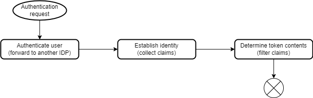

# OIDC-Servers

This is a "collection" (of currently one item) of servers, that help us to provide OIDC authentication within our ecosystem.

## OIDC.ProtocolServer

The OIDC ProtocolServer is meant to take an incomming OIDC authentication request and create a response for it.
It'll forward the actual authentication to a remote server using any authentication protocol and then provide an OIDC compatible answer for the requestor.

The highlevel process implemented in the server is the following:

### Authenticate the user

Currently, we'll not authenticate the user "on our own", but forward the authentication to another IDP. When it's flow is finished, we'll take back control and follow through the other steps. A local authentication cookie will be set for a short period of time.

### Establish identity

After authentication, we establish the identity of the user. Essentially this is collecting the claims by asking some systems, what the know about the user.

Currently there are three sources of claims, that will provide parts of the users identity:
- the remote authentication claims
- an ActiveDirectory containing information about the user
- a system called IDM internally (esentially a database that knows additional stuff about the users)

If the claims are collected, an internal ClaimsPrincipal is created, that will then be used to create the claims.

### Determine token contents

The token contents will depend on OIDC client and OIDC scopes. Both have a set of properties describing the claims needed and if those claims shoudl be placed in the access token or the id_token (claims the client requests are always placed in id token, claims required by scopes can be placed in id token, access token or both).

If the contents have been properly filtered, they'll be sent as OIDC response.